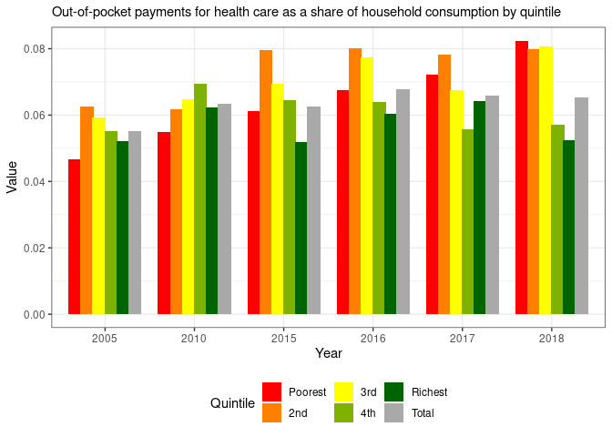
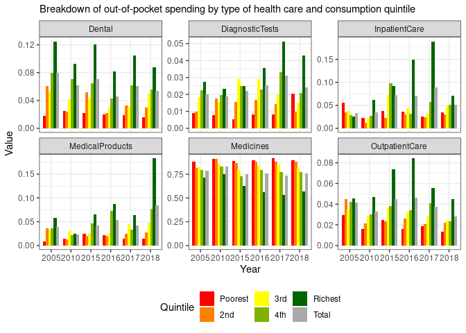
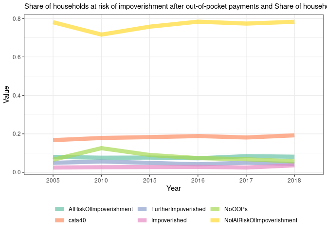
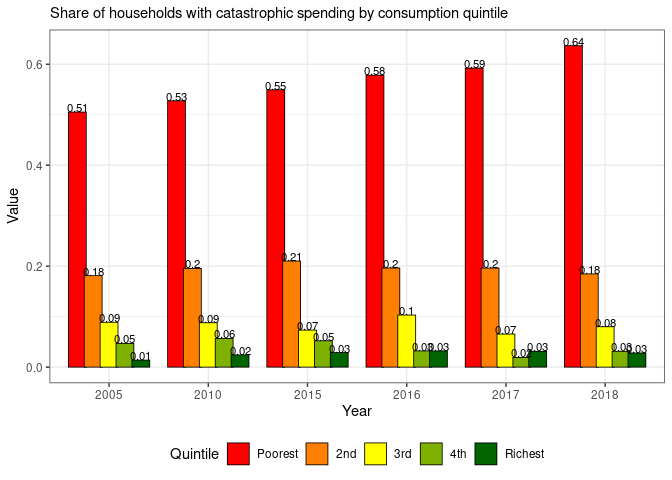
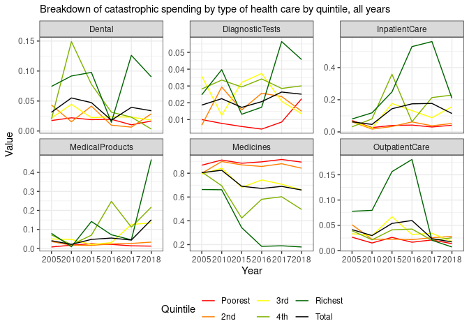

<!-- README.md is generated from README.Rmd. Please edit that file -->

# whobcnapp

<!-- badges: start -->

[](https://lifecycle.r-lib.org/articles/stages.html#experimental)
[](https://codecov.io/gh/databrew/whobcn?branch=main)
<!-- badges: end -->

`whobcnapp` is an R package containing utilities for both (a)
transforming data per the specifications of the “Data Assessment Report”
and and (b) visualizing that data in the form of a production-ready
shiny web application.

## Installation

You can install the most recent version of `whobcnapp` from
[GitHub](https://github.com/) with the following:

``` r
# install.packages("devtools")
devtools::install_github('databrew/whobcnapp')
```

Alternatively, one can build the package locally by first cloning the
<https://github.com/databrew/whobcnapp> repository, then running the
`build_package.R` script.

## Usage

### Data transformation utilities

#### Overview

The functions for “cleaning” data are customized for the formats
currently used by the office. In general terms, the work flow is as
follows:

  - Define an “input” document (a country-specific MS Excel file)
  - Run a series of operations on that document, thereby generating…
  - An “output” of a series of machine-readable, structured tables ready
    for (a) upload to a SQL database, (b) manipulation or analysis as
    flat files using a statistical software, or (c) consumption by a web
    app.

For further details on the rationale and formats of these
transformations, see the “UHC Policy Watch Platform Design: DATA
ASSESSMENT REPORT”.

#### Walk-through

One starts by preparing the workspace with the necessary packages:

``` r
library(tidyr)
library(dplyr)
library(lubridate)
library(readxl)
library(whobcnapp)
```

Next, one must define the input file to be transformed. For the purpose
of this example, we’ll use `BUL_Appendix_tables.xlsx` which is available
at
[https://github.com/databrew/whobcnapp/blob/master/data-raw/BUL\_Appendix\_tables.xlsx](https://github.com/databrew/whobcnapp/raw/master/data-raw/BUL_Appendix_tables.xlsx).

``` r
input_file <- 'data-raw/BUL_Appendix_tables.xlsx'
```

Having defined the path to the data, one uses the function
`conformity_check` to ensure that the data to be read conforms to the
requirements of the ETL process:

``` r
ok <- conformity_check(input_file)
```

If the file’s format is correct, the function will return a boolean
`TRUE`, and print a message saying:

    The file conforms. OK to go on.

Otherwise, the function will return the nature of the non-conformity.
For example:

``` r
conformity_check('xyz_tables.xlsx')
```

    Error in conformity_check("xyz_tables.xlsx") : 
      The file should be named "ISO_Appendix_tables.xlsx", where "ISO" is the 3 letter ISO code of the country in question.

Having confirmed that the file to be read is of the correct format, one
can use the `read_data` function to load each sheet of the Excel
workbook into memory:

``` r
data <- read_data(input_file)
```

The result of the `read_data` function is a list of dataframes, in which
the name of each element in the list reflects the figure for which the
data corresponds.

``` r
cat(paste0(names(data), collapse = '\n'))
#> fig1
#> fig2
#> fig3
#> fig3a
#> fig4
#> fig5
```

Data is structured uniformly into a “long” format, following the
principles of [“tidy data”](https://r4ds.had.co.nz/tidy-data.html). All
dataframe share the following columns:

  - year  
  - value  
  - indicator  
  - iso

Whereas some dataframes have additional columns such as:

  - quintile  
  - grp

Below are the column names and first 3 rows of each dataset as an
example:

``` r
for(i in 1:length(data)){
  print(names(data)[i])
  print(head(data[[i]], 3))
}
#> [1] "fig1"
#> # A tibble: 3 x 5
#>   quintile year   value iso   indicator                                         
#>   <fct>    <chr>  <dbl> <chr> <chr>                                             
#> 1 Poorest  2005  0.0468 BUL   Out-of-pocket payments for health care as a share…
#> 2 2nd      2005  0.0625 BUL   Out-of-pocket payments for health care as a share…
#> 3 3rd      2005  0.0593 BUL   Out-of-pocket payments for health care as a share…
#> [1] "fig2"
#> # A tibble: 3 x 6
#>   grp        year    value quintile iso   indicator                             
#>   <chr>      <chr>   <dbl> <fct>    <chr> <chr>                                 
#> 1 Medicines  2005  0.879   Poorest  BUL   Breakdown of out-of-pocket spending b…
#> 2 MedicalPr… 2005  0.00864 Poorest  BUL   Breakdown of out-of-pocket spending b…
#> 3 Outpatien… 2005  0.0298  Poorest  BUL   Breakdown of out-of-pocket spending b…
#> [1] "fig3"
#> # A tibble: 3 x 5
#>   grp            year   value indicator                                    iso  
#>   <chr>          <chr>  <dbl> <chr>                                        <chr>
#> 1 FurtherImpove… 2005  0.0491 Share of households at risk of impoverishme… BUL  
#> 2 Impoverished   2005  0.0247 Share of households at risk of impoverishme… BUL  
#> 3 AtRiskOfImpov… 2005  0.0801 Share of households at risk of impoverishme… BUL  
#> [1] "fig3a"
#> # A tibble: 3 x 5
#>   grp            year  value indicator                                     iso  
#>   <chr>          <chr> <dbl> <chr>                                         <chr>
#> 1 FurtherImpove… 2005    424 Households at risk of impoverishment after o… BUL  
#> 2 Impoverished   2005    130 Households at risk of impoverishment after o… BUL  
#> 3 AtRiskOfImpov… 2005    550 Households at risk of impoverishment after o… BUL  
#> [1] "fig4"
#> # A tibble: 3 x 5
#>   quintile year   value iso   indicator                                         
#>   <fct>    <chr>  <dbl> <chr> <chr>                                             
#> 1 Poorest  2005  0.505  BUL   Share of households with catastrophic spending by…
#> 2 2nd      2005  0.181  BUL   Share of households with catastrophic spending by…
#> 3 3rd      2005  0.0889 BUL   Share of households with catastrophic spending by…
#> [1] "fig5"
#> # A tibble: 3 x 6
#>   grp        year    value quintile iso   indicator                             
#>   <chr>      <chr>   <dbl> <fct>    <chr> <chr>                                 
#> 1 Medicines  2005  0.868   Poorest  BUL   Breakdown of catastrophic spending by…
#> 2 MedicalPr… 2005  0.00786 Poorest  BUL   Breakdown of catastrophic spending by…
#> 3 Outpatien… 2005  0.0265  Poorest  BUL   Breakdown of catastrophic spending by…
```

### Data visualization utilities

Having transformed data to a tidy, machine-readable format, standardized
visualizations can be constructed. In the `whobcnapp` library, this
functionality is indicated by functions with the `plot_` prefix. These
functions take a `data` object (as generated by `read_data`) and return
a `ggplot2()` object.

#### Walk-through

First, we’ll transform data so as to prepare it for plotting (covered in
previous section).

``` r
# Define the path to the input file
input_file <- 'data-raw/BUL_Appendix_tables.xlsx'
# Confirm that the data is correctly formatted
ok <- conformity_check(input_file)
# Transform the data to a tidy/long format
data <- read_data(input_file)
```

Now, we can pass the `data` object to the `plot_...` function as such:

##### Figure 1

``` r
plot_fig1(data = data)
```



##### Figure 2

``` r
plot_fig2(data = data)
```



##### Figure 3

``` r
plot_fig3(data = data)
```



##### Figure 4

``` r
plot_fig4(data = data)
```



##### Figure 5

``` r
plot_fig5(data = data)
```



### Web application

#### Development

In a development environment, an engineer will likely carry out the
following work flow:

1.  Clone this repository: `https://github.com/databrew/whobcnapp`  
2.  `cd` into it `cd whobcnapp`  
3.  Open and modify the code in `R/app.R` (for the shiny application
    itself) or in `R/...` (for upstream function code)  
4.  `cd` into `dev` and run `Rscript run_dev.R` to quickly re-build and
    serve the application locally.

#### Production

To run the web application (under construction), reproduce the following
code in an R session:

``` r
library(whobcnapp)
whobcnapp::run_app()
```
